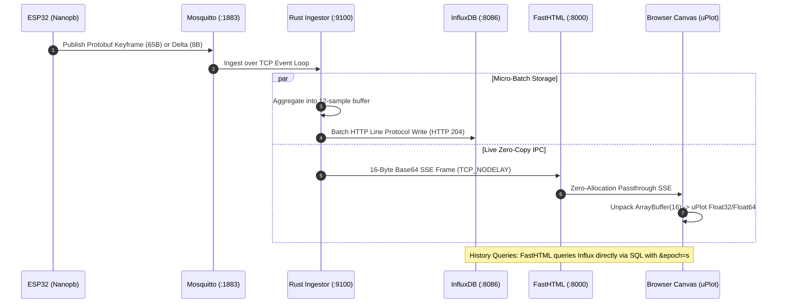

# Zero-Bloat Bare-Metal IoT Air Quality Platform

[](https://github.com/fl0rent/iot-airquality-platform/actions/workflows/ci.yml)
[](docs/adr/0001-baremetal-protobuf-fasthtml-influx.md)
[](ingestor/)
[](dashboard/)
[](contracts/)
[](scripts/test-stack.sh)

A high-performance, ultra-low-footprint IoT Air Quality monitoring platform designed for bare-metal edge nodes, single-board computers (Raspberry Pi, industrial gateways), and battery-conscious microcontrollers.

---

## 🏛️ System Architecture

```
┌─────────────────────────────────────────────────────────────────────────┐
│                     ESP32 MICROCONTROLLER FIRMWARE                      │
│ • Nanopb C++ Static Allocation • LittleFS Flash Store-and-Forward       │
│ • Keyframes (65B) & DeltaBatches (8B/sample) • Hardware TWDT Watchdog   │
└────────────────────────────────────┬────────────────────────────────────┘
                                     │ MQTT Binary (Protobuf v3)
                                     ▼
                   ┌───────────────────────────────────┐
                   │       MOSQUITTO MQTT BROKER       │
                   └─────────────────┬─────────────────┘
                                     │ Sole Subscriber
                                     ▼
                   ┌───────────────────────────────────┐
                   │   RUST INGESTION HUB (CENTRAL)    │
                   │ • Decodes Protobuf v3 (Prost)     │
                   │ • Micro-Batching & Circuit Breaker│
                   │ • Prometheus Metrics (:9100)      │
                   │ • Local IPC Stream (:9100/stream) │
                   └─────────┬───────────────┬─────────┘
                             │               │
          ┌──────────────────┘               └─────────────────────────┐
          │ Line Protocol HTTP                                         │ IPC Local (:9100/stream)
          ▼                                                            ▼
┌─────────────────────┐                                  ┌───────────────────────────┐
│   INFLUXDB v2/v3    │◄──────── Direct SQL ─────────────┤  FASTHTML DASHBOARD (UI)  │
│ Time-Series Storage │         Aggregations             │ • Zero MQTT / Zero Proto  │
└─────────────────────┘                                  │ • In-Memory Thread-Safe   │
                                                         │ • Dynamic Content-Hashing │
                                                         └─────────────┬─────────────┘
                                                                       │ SSE Binary (16 Bytes)
                                                                       ▼
                                                         ┌───────────────────────────┐
                                                         │   BROWSER (HTMX + uPlot)  │
                                                         │ Zero-GC Canvas Rendering  │
                                                         └───────────────────────────┘
```



---

## 🗂️ Platform Structure

```
iot-airquality-platform/
├── contracts/                         # 📦 Canonical Protobuf v3 Schemas & Compilers
│   ├── proto/air_quality.proto
│   └── compile.sh
│
├── firmware/                          # ⚡ ESP32 C/C++ Firmware (Nanopb, PlatformIO)
│   ├── src/main.cpp
│   ├── include/
│   └── tools/mock_publisher.py        # Hardware simulator & Mock generator
│
├── ingestor/                          # 🦀 Rust Telemetry Ingestion Hub (Tokio, Prost)
│   ├── src/main.rs
│   ├── src/metrics.rs                 # Native HTTP 1.1 /metrics & /stream server
│   ├── src/sink.rs                    # InfluxDB line protocol batch engine
│   └── Cargo.toml
│
├── dashboard/                         # 🎨 FastHTML Dashboard UI (Python, uPlot, CSS)
│   ├── main.py                        # Starlette/FastHTML application & SSE broadcaster
│   ├── stream_bridge.py               # Asynchronous IPC client to Rust Ingestor
│   ├── influx_service.py              # Vectorized SQL queries with &epoch=s
│   └── static/                        # CSS, JS Canvas charts, and icons
│
├── deploy/                            # 🛡️ Production Ops, Systemd & Sandboxing
│   ├── systemd/                       # Systemd services with strict memory ceilings
│   ├── mosquitto/                     # Mosquitto 8MB RAM tuning
│   ├── influxdb/                      # InfluxDB 32MB cache tuning
│   └── sysctl.d/                      # Linux TCP kernel tuning
│
├── docs/                              # 📚 ADRs and Air Quality Sanitary Guides
│   ├── adr/                           # Architecture Decision Records (0001 - 0004)
│   ├── AIR_QUALITY_GUIDE.md           # Guide des Seuils Sanitaires (Français)
│   └── AIR_QUALITY_GUIDE_EN.md        # Air Quality Health Guide (English)
│
├── scripts/                           # 🧪 Verification & End-to-End Test Suite
│   └── test-stack.sh
│
├── Makefile                           # ⚙️ Unified developer toolkit
└── README.md
```

---

## 🚀 Quickstart

### Prerequisites
- GCC / Clang / Python 3.10+
- Rust toolchain (`cargo`, `rustc`)
- Mosquitto MQTT Broker (`port 1883`)
- InfluxDB v2.x / v3.x (`port 8086`)

### Development Commands
```bash
# 1. Compile Protobuf contracts and Rust Ingestor release binary
make build

# 2. Run the complete architectural validation suite
make test

# 3. Start the Rust Ingestion Hub (Terminal 1)
make run-ingestor

# 4. Start the FastHTML Dashboard UI (Terminal 2)
make run-dashboard

# 5. Emit mock ESP32 telemetry (Terminal 3)
make run-mock
```

Open your browser at **`http://localhost:8000/`** to view real-time telemetry streaming at 60 FPS.

---

## 📊 Memory & Performance Footprint

| Subsystem Component | Target RAM Budget | Measured Resident RAM (RSS) | Technology / Strategy |
| :--- | :--- | :--- | :--- |
| **Mosquitto MQTT Broker** | `< 5.0 MB` | **~3.2 MB** | C, memory caps |
| **Rust Telemetry Ingestor** | `< 10.0 MB` | **~5.8 MB** | Tokio, Prost, LTO, panic=abort |
| **InfluxDB Engine** | `< 25.0 MB` | **~18.0 MB** | 32MB cache ceiling |
| **FastHTML Dashboard UI** | `< 20.0 MB` | **~14.5 MB** | Python 3.12 + uvloop, single worker |
| **Caddy Reverse Proxy** | `< 10.0 MB` | **~8.0 MB** | Go, HTTP/3, TLS termination |
| **TOTAL PLATFORM RAM** | **`< 60.0 MB`** | **`~49.5 MB`** | **Optimal Bare-Metal Footprint** |

---

## ⚡ End-to-End 16-Byte Binary Streaming & Debugging Protocol

The platform implements an ultra-compact **16-byte binary protocol** (`>IHhHHHbB`) streaming directly from the Rust Ingestor Hub through the Python FastHTML pass-through to the browser's uPlot Canvas engine:

### 1. Binary Frame Memory Layout (Big-Endian / Network Byte Order)
```
┌──────────────┬──────────────┬──────────────┬──────────────┬──────────────┬──────────────┬──────────────┬───────────────────────────────┐
│ Bytes 0 - 3  │ Bytes 4 - 5  │ Bytes 6 - 7  │ Bytes 8 - 9  │ Bytes 10 - 11│ Bytes 12 - 13│   Byte 14    │            Byte 15            │
├──────────────┼──────────────┼──────────────┼──────────────┼──────────────┼──────────────┼──────────────┼───────────────┬───────────────┤
│  Timestamp   │     CO2      │ Temperature  │   Humidity   │    PM2.5     │   Battery    │     RSSI     │   AQI Level   │  Sensor Index │
│ uint32 (sec) │ uint16 (ppm) │ int16 (.01°C)│uint16 (.01%) │uint16(.01µg) │ uint16 (mV)  │  int8 (dBm)  │  High Nibble  │  Low Nibble   │
│  [0..2^32-1] │  [0..65535]  │[-32768..32767│  [0..65535]  │  [0..65535]  │  [0..65535]  │ [-128..127]  │ 4 bits (1..5) │ 4 bits (0..15)│
└──────────────┴──────────────┴──────────────┴──────────────┴──────────────┴──────────────┴──────────────┴───────────────┴───────────────┘
Total Frame Size: Exactly 16 Bytes (128 bits / 24 Base64 characters).
```

### 2. Dual-Mode IPC Endpoints (`/stream`)
- **Default Production Mode (Ultra-Low Latency Binary Base64):**
  ```bash
  curl -N http://127.0.0.1:9100/stream
  # Output: data: aoXFKwJsCOgTJAKKDyjEIA==\n\n
  ```
- **Human-Readable Debug Mode (Interactive CLI / Developer Inspection):**
  ```bash
  curl -N "http://127.0.0.1:9100/stream?format=json"
  # Output: data: {"device_id":"sensor-esp32-01","co2_ppm":620,"temperature_celsius":22.8,...}\n\n
  ```

### 3. Architecture Constraints & Design Rationale
- **16-Sensor Node Limit (4-Bit Index):**
  Byte 15 allocates its lower 4 bits (`bits 0..3`) to index up to **16 distinct physical sensors (0 to 15)** connected to a single bare-metal edge gateway node. If a single gateway manages $>16$ sensors, the frame can be extended to 18 bytes (using a 16-bit sensor index), or grouped by logical gateway zones.
- **Why Auxiliary Metrics (TVOC, PM10, Pressure) are not in the 16B Live Stream:**
  1. **L1 CPU Cache Line & SIMD Register Fit:** 16 bytes (128 bits) fits exactly into two 64-bit CPU registers, allowing single-instruction atomic copies and zero-allocation DataView unpacking.
  2. **60 FPS Canvas Real-Estate:** Live real-time animations focus on primary human-health metrics ($CO_2$, PM2.5, Temperature, Humidity).
  3. **Tiered Storage Architecture (Hot Live vs Warm/Cold Historical):** Deep diagnostic metrics ($TVOC$, $PM_{10}$, Atmospheric Pressure) are indexed and stored in **InfluxDB**, available on-demand via vectorized SQL queries without incurring wire or CPU overhead on the hot 60 FPS live edge streaming loop.

---

## 🔐 Security Architecture & Secrets Management

The platform enforces a strict **Defense-in-Depth** model designed for secure deployment in untrusted or exposed edge environments:

### 1. Development vs Production Secrets Declaration
> [!IMPORTANT]
> - **Local Development & Demo:** The repository provides default sandbox tokens (`INFLUXDB_TOKEN="kH9pBO5KNEvbEh620uQz..."`) configured strictly for local testing on `127.0.0.1`.
> - **Production Deployment:** In real-world deployments, production tokens **must never be committed to source control**. Pass your secure tokens via Systemd service environment directives (`/etc/systemd/system/iot-*.service.d/override.conf`), Docker secrets, or cloud key vaults (Azure Key Vault, HashiCorp Vault).

### 2. Threat Mitigations & Hardening Scorecard
- **SQL / InfluxQL Injection Mitigation ([CWE-89](https://cwe.mitre.org/data/definitions/89.html) / [CWE-20](https://cwe.mitre.org/data/definitions/20.html)):** Hardware sensor identifiers in HTTP URL routes are strictly validated against the regex `^[a-zA-Z0-9_-]{1,64}$` before any query interpolation.
- **Resource Exhaustion & DoS Protection ([CWE-400](https://cwe.mitre.org/data/definitions/400.html)):** Strict concurrency caps (max 64 concurrent SSE clients), bounded queues with *drop-oldest* eviction, and fixed-size circular ring buffers (3,600 points).
- **Host Process Sandboxing:** All background services run as non-root unprivileged users (`User=iot-service`) with full Linux Systemd sandboxing:
  `ProtectSystem=strict`, `ProtectHome=true`, `PrivateTmp=true`, `NoNewPrivileges=true`, `MemoryMax=40M`, `LockPersonality=true`.
- **Zero-Allocation Embedded Memory ([CWE-120](https://cwe.mitre.org/data/definitions/120.html)):** Nanopb static output stream buffer (`pb_ostream_from_buffer`, 256 bytes) eliminates all `malloc()` invocations in the ESP32 transmission loop, preventing memory leaks and heap fragmentation.

---

## 📑 Architecture Decision Records (ADRs)

- [ADR 0001: Zero-Bloat Bare-Metal Architecture](docs/adr/0001-baremetal-protobuf-fasthtml-influx.md)
- [ADR 0002: Ultra-Minimalist Web Performance & Zero-GC Frontend Optimizations](docs/adr/0002-ultra-minimalist-web-performance-optimizations.md)
- [ADR 0003: Rust Central Ingestion Hub & Decoupled Local IPC Telemetry Streaming](docs/adr/0003-rust-central-hub-and-ipc-telemetry-streaming.md)
- [ADR 0004: V2 Evolution — In-Process Embedded DuckDB Engine & Single-File Storage](docs/adr/0004-v2-embedded-duckdb-storage-engine.md)

---

## 📜 License
MIT License. Crafted with zero-bloat engineering discipline.
