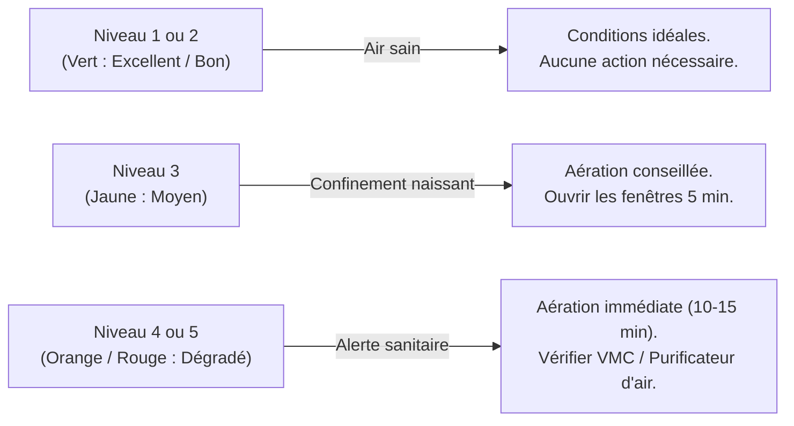

# Guide Fonctionnel & Sanitaire de la Qualité de l'Air Intérieur

*Langues : 🇫🇷 **Français** | [🇬🇧 English](AIR_QUALITY_GUIDE_EN.md)*

Ce document détaille les fondements scientifiques, les impacts sur la santé et les règles de calcul de l'indice de qualité de l'air (**AQI / ATMO**) suivis par la plateforme **IoT Air Quality Hub**.

---

## 1. Pourquoi Surveiller la Qualité de l'Air Intérieur ?

Nous passons en moyenne **85% à 90% de notre temps dans des espaces clos** (domicile, bureaux, salles de classe, ateliers, transports). Or, l'air intérieur est fréquemment **2 à 5 fois plus pollué que l'air extérieur** (source : *EPA / ANSES*), en raison de la concentration des polluants, des activités humaines et d'une ventilation parfois insuffisante.

### Les Bénéfices Concrets pour l'Utilisateur
- 🧠 **Performance Cognitive & Productivité :** Le maintien d'un taux de CO₂ maîtrisé prévient la somnolence, les maux de tête et améliore la concentration et la prise de décision.
- 🫁 **Santé Respiratoire & Cardiovasculaire :** La détection précoce des particules fines (PM2.5) et des composés organiques volatils (COV) protège les poumons contre les inflammations chroniques et les crises d'asthme.
- 🦠 **Réduction des Risques Épidémiologiques :** Un taux élevé de CO₂ est un indicateur direct de confinement de l'air, corrélé à une stagnation des aérosols porteurs de virus.
- 💡 **Aération Sobre & Maîtrise Énergétique :** Aérer au moment opportun (uniquement lorsque l'indice l'exige, 5 à 10 minutes) évite les déperditions thermiques excessives en hiver ou en période de canicule.

---

## 2. Indicateurs Mesurés & Impacts Sanitaires

La plateforme assure la captation et le suivi continu de 5 familles de grandeurs physiques et chimiques :

```
┌──────────────────────────────────────────────────────────────────────────────────┐
│                        LES 5 FAMILLES D'INDICATEURS SUIVIS                       │
├─────────────────────┬──────────────┬───────────────────┬─────────────────────────┤
│ Grandeur Mesurée    │ Unité        │ Capteur Type      │ Impact Sanitaire Clé    │
├─────────────────────┼──────────────┼───────────────────┼─────────────────────────┤
│ CO₂ (Dioxyde de C)  │ PPM          │ NDIR Optique      │ Confinement, Fatigue    │
│ PM2.5 (Particules)  │ µg/m³        │ Laser Scattering  │ Alvéoles & Système sang │
│ TVOC (Composés Vol) │ PPB          │ MOX semi-cond.    │ Irritation, Neurotox.   │
│ Température         │ °C           │ Thermistance / IC │ Confort, Stress thermiq │
│ Humidité Relative   │ % RH         │ Capacitif         │ Moisissures, Muqueuses  │
└─────────────────────┴──────────────┴───────────────────┴─────────────────────────┘
```

---

### 🟢 A. Dioxyde de Carbone ($CO_2$) — Indicateur Majeur de Confinement

Le $CO_2$ n'est pas un polluant toxique à faible dose, mais il est le **marqueur universel de la respiration humaine et du renouvellement d'air**.

- **Origine :** Expiration humaine (un adulte expire environ 20 litres de $CO_2$ par heure).
- **Conséquences physiologiques :**
  - **400 – 600 ppm :** Air neuf extérieur, conditions optimales de travail et d'oxygénation.
  - **800 – 1 000 ppm :** Seuil de confort et de performance recommandé (*HCSP / Norme EN 13779*).
  - **1 000 – 1 500 ppm :** Baisse mesurable des facultés cognitives (-15% de temps de réaction), fatigue, somnolence, sensation d'air lourd.
  - **> 1 500 ppm :** Confinement critique (*seuil d'aération impératif*), maux de tête, risque accru de transmission d'agents pathogènes aéroportés.

---

### 🟡 B. Particules Fines ($PM_{2.5}$ & $PM_{10}$) — Risque Respiratoire & Cardiovasculaire

Les particules fines sont des aérosols solides ou liquides en suspension.
- **$PM_{10}$ ($< 10\ \mu\text{m}$) :** Poussières, pollens, retenus par les voies aériennes supérieures (nez, gorge).
- **$PM_{2.5}$ ($< 2.5\ \mu\text{m}$) :** Particules très fines (fumées, suies, combustion, usure de matériaux).

- **Impact sanitaire (*Lignes directrices OMS 2021*) :**
  Les $PM_{2.5}$ pénètrent profondément dans les **alvéoles pulmonaires** et franchissent la barrière alvéolo-capillaire pour rejoindre la circulation sanguine. L'exposition chronique aggrave l'asthme, favorise les maladies cardiovasculaires, l'hypertension et les cancers respiratoires.
- **Seuils OMS 2021 :** Moyenne annuelle $< 5\ \mu\text{g/m³}$, moyenne sur 24h $< 15\ \mu\text{g/m³}$.

---

### 🟣 C. Composés Organiques Volatils Totaux ($TVOC$) — Polluants Chimiques

Les COV regroupent une multitude de substances chimiques gazeuses (formaldéhyde, benzène, acétone, solvants, terpènes).

- **Origine :** Produits d'entretien, désodorisants, bougies parfumées, peintures, colles de meubles neufs, feutres, cuisson d'aliments.
- **Impact sanitaire :**
  - **Court terme :** Irritation des yeux, du nez et de la gorge, nausées, réactions allergiques, déclenchement de migraines.
  - **Long terme :** Certaines molécules (benzène, formaldéhyde) sont classées cancérigènes avérés (Groupe 1 du CIRC).

---

### 🔵 D. Température & Humidité Relative ($RH$) — Confort & Facteur Environnemental

- **Humidité $< 30\%$ :** Dessèchement des muqueuses respiratoires (les rendant plus vulnérables aux infections virales), électricité statique.
- **Humidité $> 65\%$ :** Développement exponentiel d'acariens et de moisissures (libérant des mycotoxines et spores allergisantes).
- **Plage idéale recommandée :** **40% à 60% d'humidité** pour une température comprise entre **19°C et 22°C** en hiver / **24°C et 26°C** en été.

---

## 3. Moteur de Calcul de l'Indice Synthétique (AQI / ATMO)

Pour faciliter la décision de l'utilisateur, la plateforme calcule en temps réel un **score composite de 1 à 5**.

### La Règle du Facteur Limitant (*Worst-Case Principle*)
La qualité de l'air est dictée par son composant le plus dégradé :
$$\text{Indice Global} = \max\left(\text{Niveau}_{CO_2},\ \text{Niveau}_{PM_{2.5}},\ \text{Niveau}_{TVOC}\right)$$

```
┌───────────────┬─────────────────┬─────────────────┬──────────────────┬─────────────────┐
│ NIVEAU GLOBAL │ QUALIFICATION   │ CO₂ (ppm)       │ PM2.5 (µg/m³)    │ TVOC (ppb)      │
├───────────────┼─────────────────┼─────────────────┼──────────────────┼─────────────────┤
│ 🌿 Niveau 1   │ Excellent       │ < 600           │ < 5.0            │ < 65            │
│ 🌱 Niveau 2   │ Bon             │ 600 – 800       │ 5.0 – 12.0       │ 65 – 220        │
│ 🟡 Niveau 3   │ Moyen           │ 800 – 1000      │ 12.0 – 25.0      │ 220 – 660       │
│ ⚠️ Niveau 4   │ Dégradé         │ 1000 – 1500     │ 25.0 – 50.0      │ 660 – 2200      │
│ 🚨 Niveau 5   │ Mauvais         │ > 1500          │ > 50.0           │ > 2200          │
└───────────────┴─────────────────┴─────────────────┴──────────────────┴─────────────────┘
```

---

## 4. Guide des Bonnes Pratiques & Actions Recommandées

Lorsque le dashboard indique un changement de statut, voici les actions adaptées à mener :



1. **Aération Naturelle Traversante :** Ouvrir en grand plusieurs fenêtres en créant un courant d'air pendant 5 à 10 minutes renouvelle 100% de l'air d'une pièce sans refroidir les murs.
2. **Maintenance de la Ventilation :** Vérifier l'état et l'encrassement des bouches d'extraction (VMC) et filtres d'entrée d'air.
3. **Identification des Sources Émissives :** Si le niveau de $TVOC$ ou $PM_{2.5}$ reste élevé fenêtres fermées, identifier la source (imprimante 3D, produits chimiques, encens, travaux, présence d'un animal).

---

## 5. Références Scientifiques & Normatives

1. **OMS (Organisation Mondiale de la Santé) :** *WHO Global Air Quality Guidelines (2021)* — Recommandations sanitaires pour les particules fines ($PM_{2.5}$, $PM_{10}$), dioxyde d'azote et ozone.
2. **Haut Conseil de la Santé Publique (HCSP, France) :** *Avis relatif à la qualité de l'air dans les lieux fermés recevant du public (ERP)* — Recommandation du seuil repère de $800\ \text{ppm}$ de $CO_2$.
3. **ANSES (Agence nationale de sécurité sanitaire de l'alimentation, de l'environnement et du travail) :** *Valeurs Guides de Qualité de l'Air Intérieur (VGAI)* — Études toxicologiques sur le formaldéhyde, le benzène et les particules.
4. **Norme Européenne EN 16798-1 / EN 13779 :** *Performance énergétique des bâtiments - Ventilation des locaux et critères d'ambiance intérieure*.
