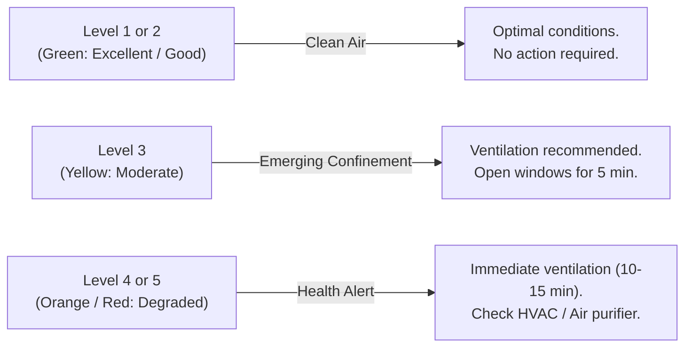

# Functional & Health Guide for Indoor Air Quality

*Languages: [🇫🇷 Français](AIR_QUALITY_GUIDE.md) | 🇬🇧 **English***

This document details the scientific foundations, health impacts, and calculation rules of the Air Quality Index (**AQI / ATMO**) monitored by the **IoT Air Quality Hub** platform.

---

## 1. Why Monitor Indoor Air Quality?

We spend on average **85% to 90% of our time indoors** (homes, offices, classrooms, workshops, public transportation). Yet indoor air is frequently **2 to 5 times more polluted than outdoor air** (source: *EPA / ANSES*), due to the concentration of pollutants, human metabolic activity, and insufficient ventilation.

### Tangible Benefits for the User
- 🧠 **Cognitive Performance & Productivity:** Maintaining controlled $CO_2$ levels prevents drowsiness, headaches, and enhances concentration and decision-making abilities.
- 🫁 **Respiratory & Cardiovascular Health:** Early detection of fine particulate matter ($PM_{2.5}$) and volatile organic compounds ($TVOC$) protects lungs against chronic inflammation and asthma triggers.
- 🦠 **Epidemiological Risk Reduction:** High $CO_2$ is a direct proxy for stale air confinement, correlated with the stagnation of airborne pathogen aerosols.
- 💡 **Smart Ventilation & Energy Efficiency:** Airing rooms at the right time (only when required by the index, for 5 to 10 minutes) avoids excessive heat loss in winter or cooling loss during heatwaves.

---

## 2. Tracked Indicators & Health Impacts

The platform provides continuous sensing and monitoring across 5 families of physical and chemical parameters:

```
┌──────────────────────────────────────────────────────────────────────────────────┐
│                         5 MONITORED INDICATOR FAMILIES                           │
├─────────────────────┬──────────────┬───────────────────┬─────────────────────────┤
│ Measured Parameter  │ Unit         │ Sensor Type       │ Key Health Impact       │
├─────────────────────┼──────────────┼───────────────────┼─────────────────────────┤
│ CO₂ (Carbon Dioxide)│ PPM          │ Optical NDIR      │ Confinement, Fatigue    │
│ PM2.5 (Fine Dust)   │ µg/m³        │ Laser Scattering  │ Alveoli & Bloodstream   │
│ TVOC (Volatile Org) │ PPB          │ MOX Semiconductor │ Irritation, Neurotox.   │
│ Temperature         │ °C           │ Thermistor / IC   │ Comfort, Thermal Stress │
│ Relative Humidity   │ % RH         │ Capacitive        │ Mold, Mucous Membranes  │
└─────────────────────┴──────────────┴───────────────────┴─────────────────────────┘
```

---

### 🟢 A. Carbon Dioxide ($CO_2$) — Primary Proxy for Stale Air Confinement

$CO_2$ is not toxic at low concentrations, but serves as the **universal benchmark for human respiration and fresh air exchange**.

- **Source:** Human exhalation (an adult exhales approximately 20 liters of $CO_2$ per hour).
- **Physiological effects:**
  - **400 – 600 ppm:** Fresh outdoor air, optimal conditions for mental acuity and oxygenation.
  - **800 – 1,000 ppm:** Recommended baseline comfort and performance threshold (*HCSP / EN 13779 standard*).
  - **1,000 – 1,500 ppm:** Measurable drop in cognitive faculties (-15% reaction speed), drowsiness, lethargy, feeling of stuffy air.
  - **> 1,500 ppm:** Critical confinement (*mandatory ventilation threshold*), headaches, elevated risk of airborne disease transmission.

---

### 🟡 B. Fine Particulate Matter ($PM_{2.5}$ & $PM_{10}$) — Respiratory & Cardiovascular Risk

Particulate matter consists of airborne solid or liquid microscopic aerosols.
- **$PM_{10}$ ($< 10\ \mu\text{m}$):** Dust, pollen, trapped by upper airways (nose, throat).
- **$PM_{2.5}$ ($< 2.5\ \mu\text{m}$):** Fine particles (combustion, smoke, soot, mechanical wear).

- **Health impact (*WHO Global Air Quality Guidelines 2021*):**
  $PM_{2.5}$ particles penetrate deep into the **pulmonary alveoli** and cross the alveolar-capillary barrier into the bloodstream. Chronic exposure exacerbates asthma, promotes cardiovascular diseases, hypertension, and lung cancers.
- **WHO 2021 Thresholds:** Annual average $< 5\ \mu\text{g/m³}$, 24-hour average $< 15\ \mu\text{g/m³}$.

---

### 🟣 C. Total Volatile Organic Compounds ($TVOC$) — Chemical Pollutants

TVOC encompasses a wide variety of gaseous carbon-based chemical substances (formaldehyde, benzene, acetone, industrial solvents, terpenes).

- **Source:** Cleaning agents, air fresheners, scented candles, paints, adhesives in new furniture, markers, cooking emissions.
- **Health impact:**
  - **Short term:** Eye, nose, and throat irritation, nausea, allergic flare-ups, migraine triggers.
  - **Long term:** Certain compounds (benzene, formaldehyde) are classified as known human carcinogens (IARC Group 1).

---

### 🔵 D. Temperature & Relative Humidity ($RH$) — Comfort & Environmental Factor

- **Humidity $< 30\%$:** Drying of respiratory mucous membranes (increasing susceptibility to viral infections), electrostatic discharge.
- **Humidity $> 65\%$:** Exponential growth of dust mites and mold colonies (releasing allergen spores and mycotoxins).
- **Recommended optimal range:** **40% to 60% relative humidity** with temperatures between **19°C and 22°C** in winter / **24°C and 26°C** in summer.

---

## 3. Composite Air Quality Index Calculation Engine (AQI / ATMO)

To facilitate intuitive user decision-making, the platform computes a real-time **composite score from 1 to 5**.

### The Worst-Case Limiting Factor Principle
Overall air quality is dictated by its most degraded individual component:
$$\text{Global Index} = \max\left(\text{Level}_{CO_2},\ \text{Level}_{PM_{2.5}},\ \text{Level}_{TVOC}\right)$$

```
┌───────────────┬─────────────────┬─────────────────┬──────────────────┬─────────────────┐
│ GLOBAL LEVEL  │ QUALIFICATION   │ CO₂ (ppm)       │ PM2.5 (µg/m³)    │ TVOC (ppb)      │
├───────────────┼─────────────────┼─────────────────┼──────────────────┼─────────────────┤
│ 🌿 Level 1    │ Excellent       │ < 600           │ < 5.0            │ < 65            │
│ 🌱 Level 2    │ Good            │ 600 – 800       │ 5.0 – 12.0       │ 65 – 220        │
│ 🟡 Level 3    │ Moderate        │ 800 – 1000      │ 12.0 – 25.0      │ 220 – 660       │
│ ⚠️ Level 4    │ Poor            │ 1000 – 1500     │ 25.0 – 50.0      │ 660 – 2200      │
│ 🚨 Level 5    │ Hazardous       │ > 1500          │ > 50.0           │ > 2200          │
└───────────────┴─────────────────┴─────────────────┴──────────────────┴─────────────────┘
```

---

## 4. Best Practices & Actionable Recommendations

When the dashboard indicates a status transition, the following corrective actions are recommended:



1. **Cross-Ventilation (Natural Airing):** Opening several windows wide for 5 to 10 minutes fully renews the indoor air volume without chilling walls or furniture.
2. **Ventilation System Maintenance:** Check and clean exhaust vents (VMC/HVAC) and fresh air inlet filters.
3. **Source Identification:** If $TVOC$ or $PM_{2.5}$ remains high with closed windows, identify the local emission source (3D printer, chemical cleaning supplies, incense, renovation work, pets).

---

## 5. Scientific & Regulatory References

1. **WHO (World Health Organization):** *WHO Global Air Quality Guidelines (2021)* — Health recommendations for particulate matter ($PM_{2.5}$, $PM_{10}$), nitrogen dioxide, and ozone.
2. **HCSP (High Council for Public Health, France):** *Guidelines for Indoor Air Quality in Public Access Buildings (ERP)* — Recommends the $800\ \text{ppm}$ $CO_2$ operational baseline.
3. **ANSES (French Agency for Food, Environmental and Occupational Health & Safety):** *Indoor Air Quality Guideline Values (VGAI)* — Toxicological studies on formaldehyde, benzene, and fine particulates.
4. **European Standard EN 16798-1 / EN 13779:** *Energy performance of buildings - Ventilation for non-residential buildings - Indoor environmental criteria*.
