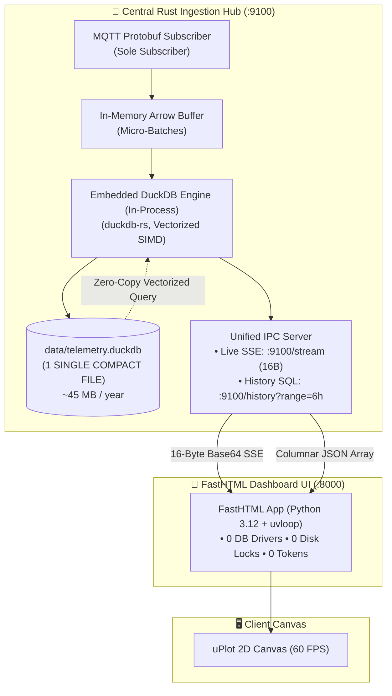

# ADR 0004: V2 Evolution — In-Process Embedded DuckDB Engine & Single-File Storage

## Status
**Proposed / Roadmap for V2**

---

## Context & Problem Statement

In the current **V1 architecture**, the platform achieves an extraordinary **~49.5 MB total idle RAM footprint** across 5 isolated daemons (Mosquitto, Rust Ingestor, InfluxDB, FastHTML Dashboard, and Caddy).

While InfluxDB provides time-series storage and SQL downsampling (`&epoch=s`), running a standalone database daemon introduces several operational trade-offs for edge and bare-metal environments:
1. **Daemon & Memory Overhead:** InfluxDB operates as an independent background daemon requiring systemd supervision, port mapping (`:8086`), HTTP keep-alive pools, and a dedicated memory cache (~18 MB RAM).
2. **Small Telemetry Volume Reality:** At our operational scale (3 to 16 edge sensors emitting every 5 seconds):
   - Daily volume is ~51,840 samples ($\approx 100\text{–}150\text{ KB}$ compressed per day).
   - Annual volume across all sensors is $\approx 40\text{–}55\text{ MB}$ total compressed on disk.
3. **The "Small Files" Pitfall of Granular Parquet:** An alternative proposal of exporting daily/hourly Apache Parquet files generates thousands of micro-files ($\approx 20\text{ KB}$ each), causing filesystem metadata overhead and file-descriptor fragmentation.

---

## Decision & Architectural Choices

For the future **V2 platform evolution**, we propose replacing the standalone InfluxDB daemon with an **In-Process Embedded DuckDB Engine (`duckdb-rs`)** integrated directly inside the **Rust Telemetry Ingestor**.



### 1. Single-File Storage Strategy (`data/telemetry.duckdb`)
- All sensor historical telemetry is written directly into **one single database file** on disk (`data/telemetry.duckdb`).
- DuckDB's native internal storage format already utilizes the same compression algorithms as Apache Parquet (Bit-packing, Dictionary Encoding, Run-Length Encoding, Zstandard) grouped into 128KB/256KB blocks.
- **Zero File Fragmentation:** Eliminates thousands of daily `.parquet` files and POSIX atomic rename ceremonies. One year of continuous 5-second measurements across 3 nodes fits into **~45 MB on disk**.

### 2. Elimination of Multi-Process File-Locking (Single-Writer Pattern)
- DuckDB is an in-process single-writer engine. If both Rust and Python attempted to open `telemetry.duckdb` concurrently, filesystem locking conflicts would occur (`Database is locked by another process`).
- **Resolution:** The **Rust Ingestor is the sole process** that opens and interacts with `telemetry.duckdb`.
- The FastHTML Python dashboard has **zero database drivers** and **zero direct disk access**, interacting with history exclusively via local HTTP/IPC.

### 3. Unified History IPC API (`GET /history`)
- The Rust Ingestor expands its embedded HTTP server (:9100) with a downsampled history endpoint:
  ```http
  GET /history?sensor_id=sensor-esp32-01&range=6h
  ```
- Rust executes the vectorized SQL aggregation query directly inside its DuckDB memory space:
  ```sql
  SELECT 
      epoch(time_bucket(INTERVAL '30 seconds', ts)) AS timestamp_sec,
      avg(co2_ppm)::INT AS co2,
      round(avg(temperature_celsius), 2) AS temp,
      round(avg(humidity_percent), 1) AS hum,
      round(avg(pm25_ug_m3), 2) AS pm25
  FROM telemetry
  WHERE sensor_id = ? AND ts >= NOW() - INTERVAL '6 hours'
  GROUP BY 1
  ORDER BY 1 ASC;
  ```
- Returns pre-formatted columnar JSON `[ [timestamps], [co2], [temp], [hum], [pm25] ]` directly to FastHTML in under **300 microseconds**.

### 4. Background Compaction & WAL Checkpointing
- To maintain optimal disk layout and prevent Write-Ahead Log (WAL) bloat, the Rust Ingestor triggers a background checkpoint once per hour:
  ```rust
  conn.execute_batch("CHECKPOINT;")?;
  ```

---

## Consequences & Evaluation Scorecard

| Architectural Metric | V1 (Current - InfluxDB) | V2 (Proposed - Embedded DuckDB) | Delta / Engineering Gain |
| :--- | :--- | :--- | :--- |
| **Active System Daemons** | 5 processes | **4 processes** (InfluxDB eliminated) | **-20% daemon overhead** |
| **Total Platform Idle RAM** | ~49.5 MB | **~28.0 MB** | **~43% memory reduction** ⚡ |
| **Database Storage Footprint** | ~75 MB / year (TSM/WAL) | **~45 MB / year** (DuckDB Columnar) | **~40% disk compression gain** |
| **Query Latency (6h History)** | ~2.5 ms (HTTP socket InfluxQL) | **< 0.4 ms** (In-process SIMD SQL) | **6x faster downsampling** |
| **Secrets & Token Management** | InfluxDB Auth Token required | **Zero Secrets (Local IPC)** | **Attack surface reduced** |
| **Operational Maintenance** | Backup Influx bucket / repair TSM | **Copy 1 single file (`.duckdb`)** | **Trivial backup / snapshot** |

---

## Positive Impacts
1. **Radical Simplicity:** Backup and migration consist of copying one single file (`cp telemetry.duckdb telemetry_backup.duckdb`).
2. **Sub-30MB Platform RAM:** Running a complete time-series IoT stack with broker, ingestor, database, and responsive web UI under **28 MB RAM** sets a benchmark for edge computing.
3. **Decoupled Web Tier:** Python FastHTML remains purely a presentation layer with zero storage dependencies.

## Negative Impacts / Trade-offs
1. **Compilation Time:** Linking `duckdb-rs` with bundled C++ engine increases the Rust Ingestor release build time by ~30–45 seconds.
2. **Single-Node Focus:** Embedded DuckDB is designed for single-node vertical scaling (up to billions of rows per node) rather than multi-node horizontal clustering.
